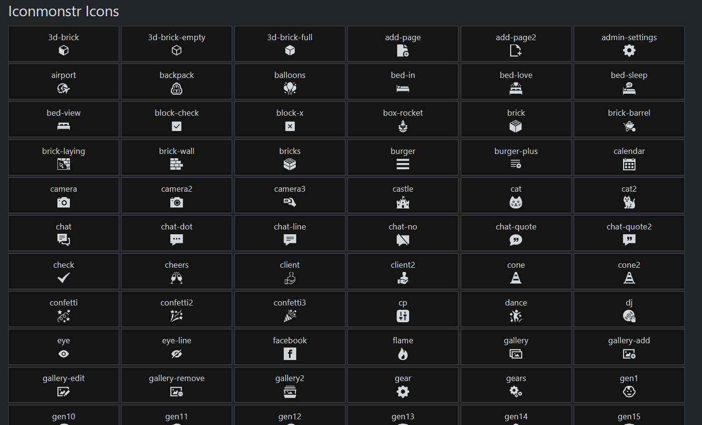
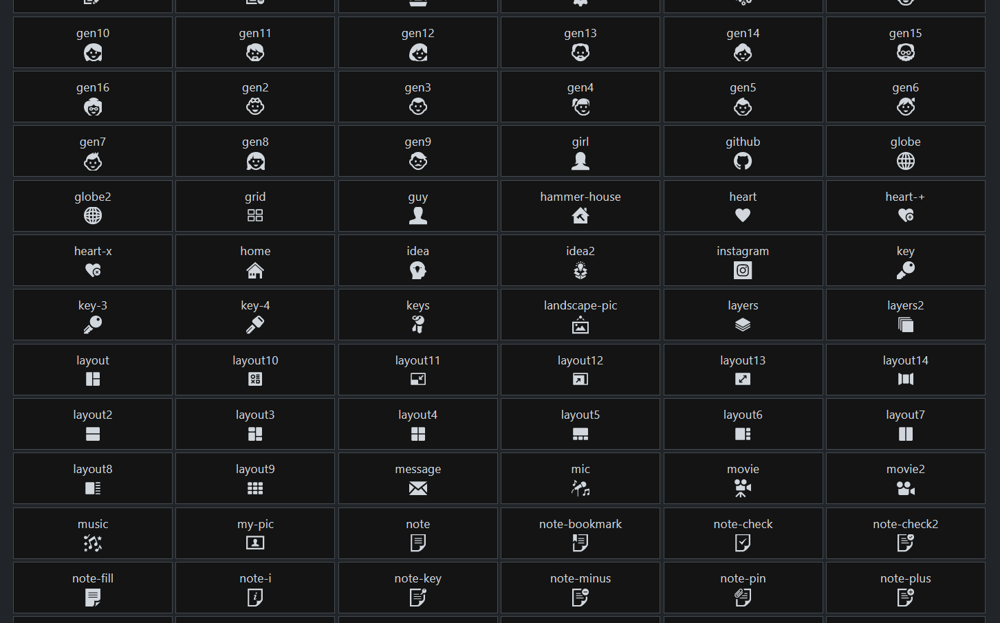
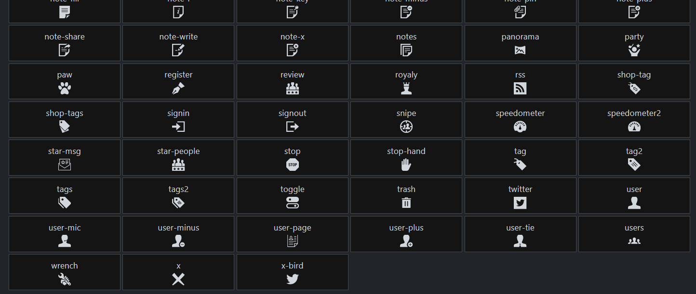
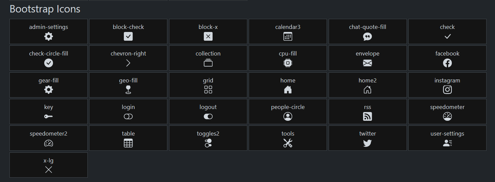

# Icons
PHP class holding some bootstrap and iconmonstr svg icons

<a target="_blank" href="https://iconmonstr.com/">iconmonstr</a> is the default icon pack that will be displayed.

# Install

````shell
composer require myjw3b/icons
````

# How to use

At the very top of your `php` page put::
````php
use JW3B\gui;
$Icons = new Icons();
````
Then where you want to display a specific icon you can use the following code: (swap `ICON NAME` with an icon name that is available.)
````php
echo $Icons->icon('ICON NAME')
````
You can see all the names available in the images below, but some new icons might have been added since I took the screenshots.
You can also see the icon names by opening the files within the <a href="list/">list</a> directory.

If you want to see all the current icons you can call the following function:
````php
echo $Icons->view_all_icons();
````
You can change the size and the font family with the following code:
````php
echo $Icons->change_family('bootstrap')->change_size(34)->icon('tools');
````
# How to add new icons
You can edit the files within the <a href="lists/">lists</a> directory.
We can also add new families of icons if you wish. If you add new families or styles - non bootstrap or iconmonstr, you can add the file following the same pattern within the list folder, and then in the <a href="classes/Icons.php">Icons.php</a> file, edit the `icon()` function, and then use the `bootstrap_icons()` and `monstr_icons()` as a reference for how to create whats needed within the class to add them.

If you do add new icons, please open a push request to update the package for everyone.
Thanks!




